# 05: Sequenties van DM's tussen Bob en Alice

Sequence diagrams van het ontwerp in `03-ontwerp.md` en `adr-001-reliable-dm.md`, inclusief de beslissingen van 29 sep 2026 en de verwerkte review (`04-review.md`). Berichtnamen, statussen, timers en velden komen uit `03`. Waar het ontwerp iets niet vastlegt dat nodig is om een scenario te tekenen, staat dat onder het diagram als "Gat in ontwerp"; alle gaten staan ook samen in de laatste paragraaf.

Bob is steeds de afzender, Alice de ontvanger, M de mailbox. Beide draaien de fork, behalve in scenario 10.

## Legenda

| notatie | betekenis |
|---|---|
| `A->>B: X` | pakket, commando of seriële regel die aankomt |
| `A-->>B: X` | antwoord, ACK of push naar een app |
| `A-xB: X` | pakket dat verloren gaat (ontvanger uit of buiten bereik) |
| grijs blok | periode waarin de deelnemer uit de eerste Note offline is |
| `Note ... : offline` / `weer online` | begin en eind van een offline-periode als blokken elkaar overlappen |
| `Bob: STATE` | toestand van Bobs outbox-entry (`03` par. 4) |
| `0x91 STATE` | `PUSH_CODE_RDM_STATUS` (0x91) met die state; alleen naar een client die `CMD_RDM_ENABLE` stuurde |
| `PUSH_CODE_SEND_CONFIRMED` | het vinkje in de standaard app (beslissing 6: bij `ACK_R`) |
| `‹id›`, `‹b64›` | plaatshouder in een regel tussen radio en Pi; in `03` par. 7 geschreven als `<id>` |
| +1 u, +30 min | tijd sinds het vorige ijkpunt in het diagram |

"Bob-app" staat voor beide soorten client: de standaard app ziet alleen `RESP_CODE_SENT` en `PUSH_CODE_SEND_CONFIRMED`, een eigen client na `CMD_RDM_ENABLE` ook 0x91.

De deelnemer "Mesh" is het pad over repeaters. Een pijl `Bob-radio -> Mesh -> Alice-radio` is één logisch pakket, direct over `out_path` of via flood.

Statussen bij Bob:

| outbox-state (`03` par. 4) | voor de gebruiker | 0x91 | standaard app |
|---|---|---|---|
| NEW, WAIT_ACK, RETRY, DEPOSITING, REGISTER | onderweg | QUEUED (aanname, gat G1) | verzonden, na eigen retries "failed" |
| CUSTODY | in bewaring | CUSTODY | geen vinkje |
| ON_RADIO | op Alice' radio | ON_RADIO | vinkje |
| ON_RADIO_FINAL | op Alice' radio (maximum bij standaard Alice) | ON_RADIO_FINAL | vinkje |
| DELIVERED | afgeleverd (Alice' telefoon) | DELIVERED | vinkje (geen verschil met ON_RADIO) |
| EXPIRED | verlopen (T_radio) | EXPIRED | "failed" |
| SYNC_EXPIRED | niet gesynct (T_sync) | SYNC_EXPIRED | vinkje |
| REJECTED | geweigerd (Alice kent Bob niet) | REJECTED | geen vinkje |

## Overzicht

Zendtijd per hop komt uit `03` par. 5 (SF8, BW 62,5 kHz, preamble 32). "Afgeleid" betekent: opgeteld uit de pakketwaarden van `03` par. 5 (DM van 157 tekens 1,72 s, `ACK_R` of `ACK_S` 0,28 s, `RECEIPT_QUERY` of STATUS plus antwoord 0,82 s, zonder antwoord 0,41 s); `03` rekent dat scenario zelf niet door.

| # | scenario | wie wanneer offline | uitkomst bij Bob | zendtijd per hop |
|---|---|---|---|---|
| 1 | basis | niemand | DELIVERED, vinkje bij `ACK_R` | 2,3 s (afgeleid) |
| 2 | Alice' telefoon weg | Alice-app tot na `ACK_R` | ON_RADIO, bij sync DELIVERED via `ACK_S` of `RECEIPT_QUERY` | 4,7 s (`03`, telefoon een dag weg) |
| 3 | Alice' radio uit bij verzenden | Alice-radio vanaf vóór het verzenden | RETRY met probes, daarna ON_RADIO en DELIVERED | 3,4 s + 0,41 s per onbeantwoorde probe + 3,1 s (afgeleid) |
| 4 | Bob weg vóór `ACK_S` | Bob-radio en -app na `ACK_R`, Alice-app tot na Bobs vertrek | `ACK_S` verloren, na terugkeer DELIVERED via `RECEIPT_QUERY` | 3,1 s (afgeleid) |
| 5 | nooit tegelijk bereikbaar | Bob en Alice afwisselend | EXPIRED na T_radio (7 d) | ~51 s over 7 dagen (afgeleid, alleen probes) |
| 6 | Alice verliest inbox vóór sync | Alice-app, en inbox en register van Alice-radio | `RECEIPT_QUERY` UNKNOWN, opnieuw verstuurd, DELIVERED, één keer getoond | 5,1 s (afgeleid) |
| 7 | mailbox, beide afwisselend weg | Alice-radio bij verzenden, daarna Bob, Alice-app tot na ophalen | CUSTODY, na terugkeer DELIVERED via STATUS | 7,9 s (`03`, mailboxbericht) |
| 8 | mailbox, Alice verliest inbox vóór sync | Alice-app, inbox en register van Alice-radio, Bob tijdelijk | ON_RADIO, RESYNC en heraflevering, DELIVERED | 7,9 s + ~3,1 s (afgeleid) |
| 9a | mailbox onbereikbaar bij DEPOSIT | Mailbox-Pi, Alice-radio tijdelijk | NO_STORAGE, RETRY, probe levert direct af | 7,1 s + 0,41 s per onbeantwoorde probe (afgeleid) |
| 9b | mailbox achterhaald, Alice bereikbaar | Alice haalt niet (meer) op bij M | CUSTODY, probe en directe DM, ON_RADIO, DELIVERED | 5,4 s + 0,82 s per STATUS-ronde (afgeleid) |
| 10 | Alice op standaard-firmware | niemand (alt: Alice-radio) | ON_RADIO_FINAL (maximum) | 2,0 s (afgeleid) |

## Zonder mailbox

### 1. Basis: beide radio's en apps online

Bob en Alice draaien de fork en Bob heeft een pad naar Alice. Bobs radio maakt een outbox-entry en stuurt de DM met cap-trailer. Alice' radio slaat het bericht persistent op en ACKt pas dan met `ACK_R` plus cap-byte. Zodra haar app het bericht gesynct heeft, stuurt ze `ACK_S`.

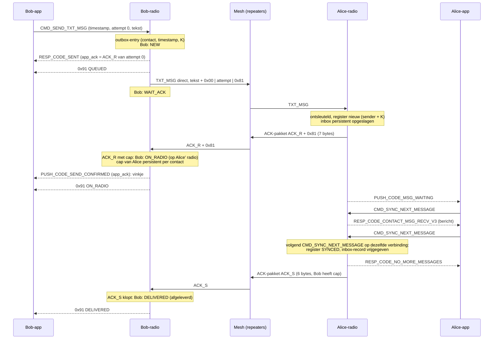

**Uitkomst**: DELIVERED. De standaard app toont het vinkje bij `ACK_R` en ziet `ACK_S` niet; een client met `CMD_RDM_ENABLE` ziet QUEUED, ON_RADIO, DELIVERED. Zonder pad gaat de DM via flood en komt `ACK_R` + `0x81` terug als PATH-extra; dat PATH zet Bobs `out_path`. Zendtijd 1,72 + 0,28 + 0,28 = 2,3 s per hop (afgeleid).

**Gat in ontwerp**

- **G1** `03` noemt de 0x91-states (QUEUED, CUSTODY, ...) en de outbox-states (NEW, WAIT_ACK, RETRY, DEPOSITING, REGISTER, ...), maar niet hoe die op elkaar afbeelden en wanneer de eerste 0x91 gaat. Hier aangenomen: QUEUED zodra de entry bestaat, zolang er geen CUSTODY of ON_RADIO is.
- **G2** Niet vastgelegd wanneer een outbox-entry vrijkomt (na DELIVERED, ON_RADIO_FINAL, EXPIRED, REJECTED; SYNC_EXPIRED verhuist naar receipt-watch). Met 8 of 16 plekken en de vlag `unreported` bepaalt dat wanneer NO_OUTBOX optreedt.

### 2. Alice' telefoon offline, radio aan

Alice' radio ontvangt en ACKt direct met `ACK_R`, want het bericht staat persistent in haar inbox. `ACK_S` volgt pas als haar app synct. Bob vraagt in ON_RADIO met `RECEIPT_QUERY` na 1 u, 4 u en 12 u; is hij online op het moment van de sync, dan komt `ACK_S` als los ACK-pakket binnen, anders bij de volgende query.

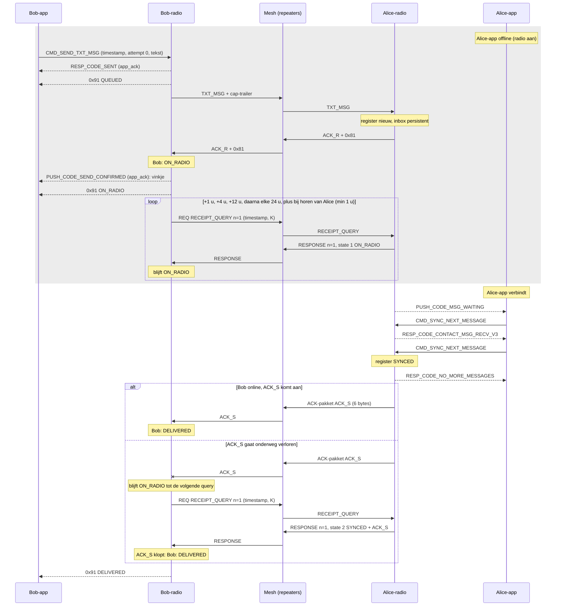

**Uitkomst**: ON_RADIO zodra Alice' radio het heeft (vinkje in de standaard app), DELIVERED na de sync. `ACK_S` wordt één keer los verzonden en niet herhaald; `RECEIPT_QUERY` vangt verlies op. Opent Alice haar app niet binnen T_sync (30 dagen), dan wordt het SYNC_EXPIRED en gaat `ACK_S` 90 dagen in receipt-watch. Zendtijd 4,7 s per hop (`03`: DM, `ACK_R`, 3 queries met antwoord, `ACK_S`). Open punt uit `03` par. 9: of de standaard app doorsynct tot `RESP_CODE_NO_MORE_MESSAGES`; zo niet, dan telt het laatste bericht pas bij de volgende verbinding als gesynct.

**Gat in ontwerp**: geen.

### 3. Alice' radio uit tijdens verzenden, later weer aan

Alice' radio is uit, dus de DM en de app-retry komen niet aan en de standaard app toont "failed". De outbox gaat door zonder app: omdat Bob Alice' cap kent uit eerder verkeer, probet hij met een kleine `RECEIPT_QUERY`. Het eerste antwoord UNKNOWN betekent dat Alice bereikbaar is en het bericht niet heeft; Bob stuurt de DM dan meteen over het pad uit het antwoord.

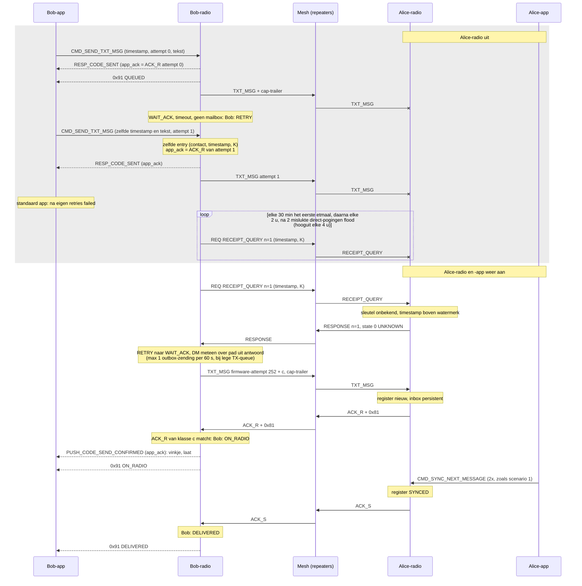

**Uitkomst**: afgeleverd binnen één probe-interval nadat Alice' radio aan gaat (R6). De standaard app toonde al "failed"; of de late `PUSH_CODE_SEND_CONFIRMED` dat nog in een vinkje verandert is open punt 2 uit `03` par. 9. Is Alice' cap onbekend, dan zijn het hele DM's met backoff (5 min, 15 min, 1 u, 4 u, 12 u, daarna elke 24 u) en komt de aflevering bij de eerste DM na het aangaan. Zendtijd (afgeleid): 2 × 1,72 voor de mislukte DM's, 0,41 per onbeantwoorde probe, daarna 0,82 + 1,72 + 0,28 + 0,28.

**Gat in ontwerp**

- **G3** De firmware-timeout van WAIT_ACK is niet gekwantificeerd (de bestaande `est_timeout` of iets eigens).
- **G4** Een probe-antwoord ON_RADIO of SYNCED in WAIT_ACK of RETRY heeft geen overgang: de toestandsmachine noemt alleen UNKNOWN en EVICTED. Dat gebeurt als de DM wel aankwam maar `ACK_R` onderweg verloren ging; Bob blijft dan proben tot T_radio en eindigt op EXPIRED voor een bericht dat Alice heeft.

### 4. Bob gaat offline na verzenden, vóór `ACK_S`

Bob heeft `ACK_R` al (ON_RADIO) en zet zijn radio uit; de outbox staat in flash. Alice synct terwijl Bob weg is, dus haar enige `ACK_S`-pakket gaat verloren. Na zijn terugkeer berekent Bob `ACK_R` en `ACK_S` opnieuw uit de opgeslagen tekst en vraagt met `RECEIPT_QUERY`.

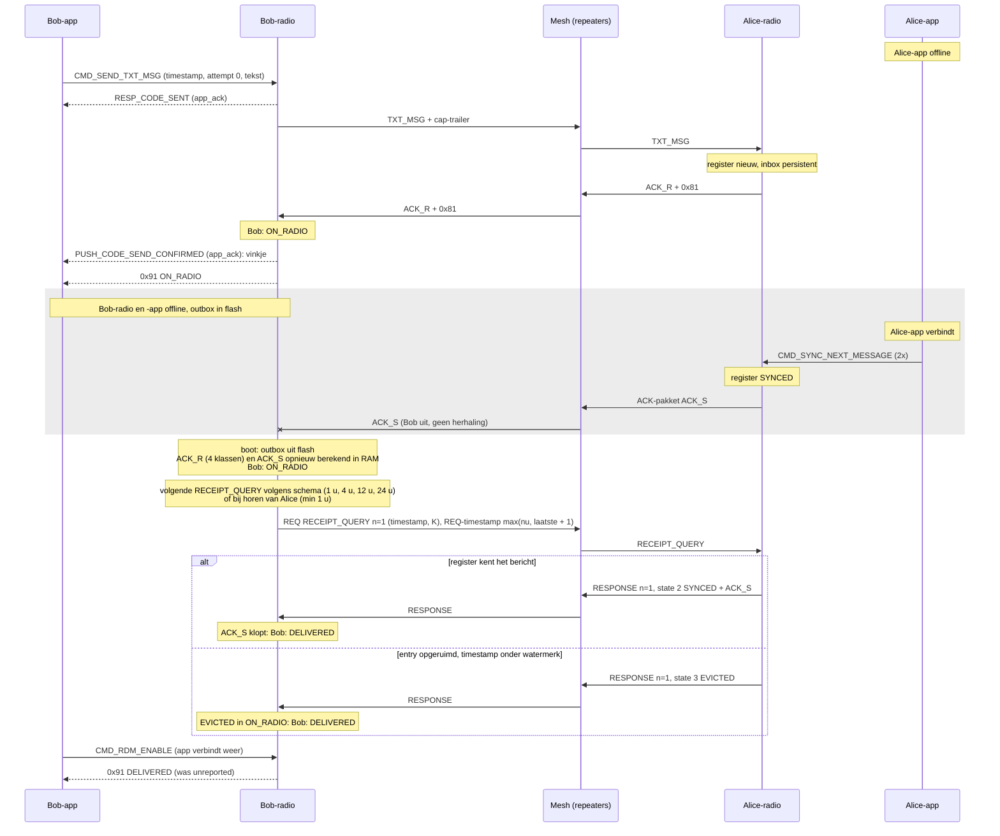

**Uitkomst**: DELIVERED, vertraagd tot de eerstvolgende query na Bobs terugkeer. EVICTED is hier gelijk aan DELIVERED, omdat Alice ongesyncte entries nooit opruimt en het antwoord versleuteld van haar komt. Zendtijd 1,72 + 0,28 + 0,28 + 0,82 = 3,1 s per hop (afgeleid), plus 0,41 s per query die Alice niet bereikt.

**Gat in ontwerp**

- **G5** Hoe statussen met vlag `unreported` bij de app komen als die terugkomt: 0x91 na `CMD_RDM_ENABLE`, via `CMD_RDM_LIST_OUTBOX`, of beide? En krijgt de standaard app alsnog `PUSH_CODE_SEND_CONFIRMED` als ze bij `ACK_R` niet verbonden was?
- **G6** Timers na een reboot zonder RTC. `03` persisteert alleen de REQ-timestamp; de klok staat na een boot zonder app stil op `lastmod + 1` (K2). Hoe T_radio, T_sync en de query- en probe-schema's dan doorlopen, en of Bob na een boot meteen een query doet, staat niet in `03` (de review stelde "timers relatief opslaan" voor, dat is niet overgenomen).

### 5. Radio's nooit tegelijk bereikbaar: T_radio verloopt

Bob en Alice staan om beurten aan en overlappen nooit. Bobs probes bereiken Alice niet, en als Alice aan staat is Bob uit; Alice' companion zendt uit zichzelf niets. Na T_radio (7 dagen) geeft Bob het op. Dit is de fysieke grens zonder mailbox.

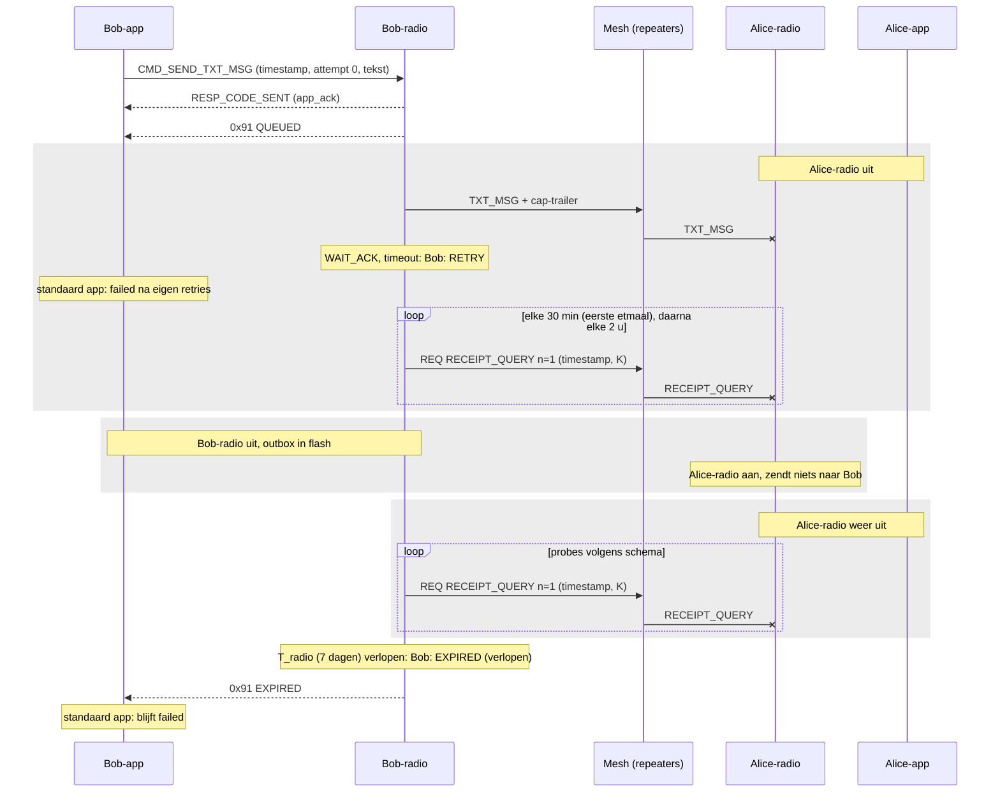

**Uitkomst**: EXPIRED. Het bericht heeft Alice nooit bereikt en niemand bewaart het. Zendtijd (afgeleid): 1,72 s voor de DM plus 120 onbeantwoorde probes (48 op dag 1, 72 op dag 2-7) × 0,41 s = ~51 s per hop over 7 dagen als Bob continu aan staat, exclusief app-retries en flood-probes (die kosten zendtijd bij elke repeater in de scope). Met mailbox (scenario 7) wordt dit wel afgeleverd.

**Gat in ontwerp**: G2 (wanneer de EXPIRED-entry vrijkomt).

### 6. Alice verliest opgeslagen berichten vóór app-sync

Een gewone reboot verliest niets: inbox en register zijn persistent en `ACK_R` gaat pas na de opslag. Verlies treedt op als het inbox- en registerbestand opnieuw worden aangemaakt (corrupt, of een update met een ander recordformaat) terwijl identiteit en contacten blijven. Bob staat dan op ON_RADIO voor een bericht dat weg is; zijn volgende `RECEIPT_QUERY` krijgt UNKNOWN en hij stuurt het opnieuw. Alice' app heeft het nooit gezien, dus er ontstaat geen duplicaat.

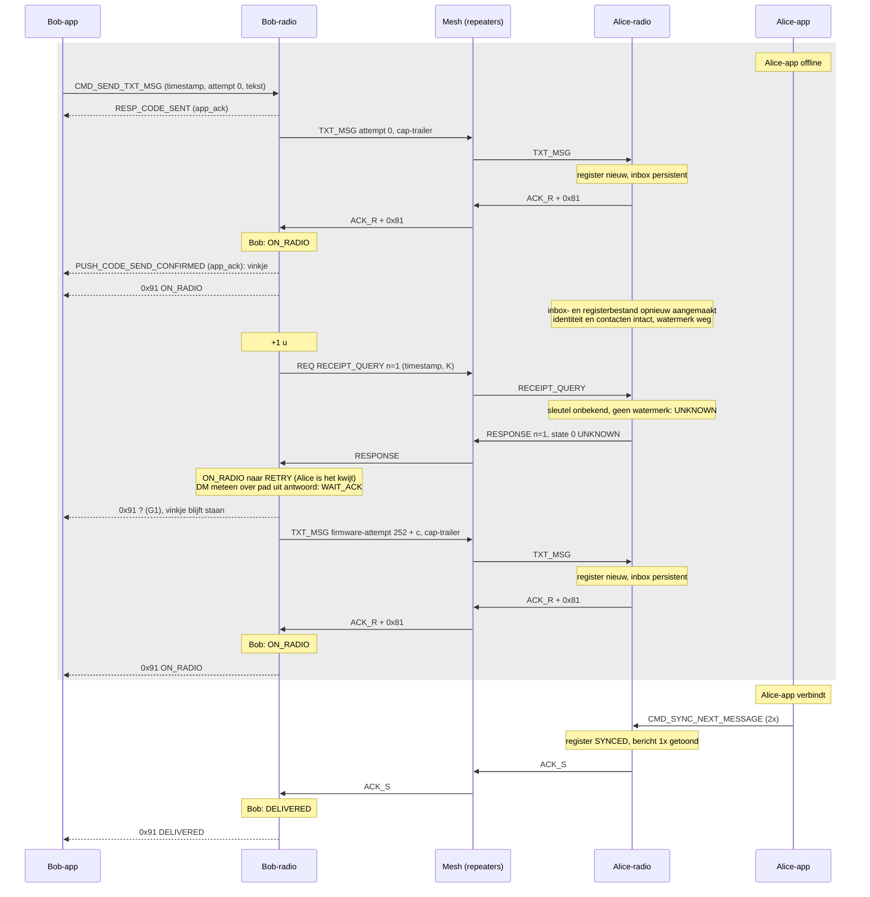

**Uitkomst**: DELIVERED, Alice ziet het bericht één keer. Tussen het verlies en de query staat Bob op "op Alice' radio" terwijl het er niet meer is; dat duurt hooguit tot de volgende query (1 u, 4 u, 12 u, 24 u). Zendtijd 1,72 + 0,28 + 0,82 + 1,72 + 0,28 + 0,28 = 5,1 s per hop (afgeleid).

**Gat in ontwerp**

- G1: welke 0x91-state Bob stuurt bij de terugval van ON_RADIO naar RETRY. Het vinkje in de standaard app kan niet worden ingetrokken.
- **G7** Gaat het verlies ná een sync waarvan `ACK_S` onderweg verloren ging, dan is ook het watermerk weg: `RECEIPT_QUERY` geeft UNKNOWN in plaats van EVICTED of SYNCED, Bob stuurt opnieuw, en Alice' app toont het bericht twee keer. `03` behandelt verlies van het register niet.

## Met mailbox

Vooraf in alle mailboxscenario's: Alice heeft met `CMD_RDM_SET_MAILBOX` haar mailbox ingesteld (mailbox pubkey, `K_owner`), Bob is favoriet bij Alice, en Alice stuurde Bob na zijn eerste fork-DM een MBX_INFO (TXT_MSG txt_type 8, sub `0x01`, mailbox pubkey, `token_B`), die Bob ACKte. M staat bij Bob en Alice in de verborgen peer-tabel.

### 7. Alice offline, Bob deponeert, Bob offline, Alice haalt op

Alice' radio is uit, dus na de time-out deponeert Bob de DM bij M. Na de commit op de Pi staat Bob op CUSTODY en gaat offline. Alice haalt op bij M, rapporteert ON_RADIO en na haar sync SYNCED in haar volgende FETCH's. Bob komt terug en leest met STATUS bij M de `ACK_S` van Alice, die hij zelf controleert.

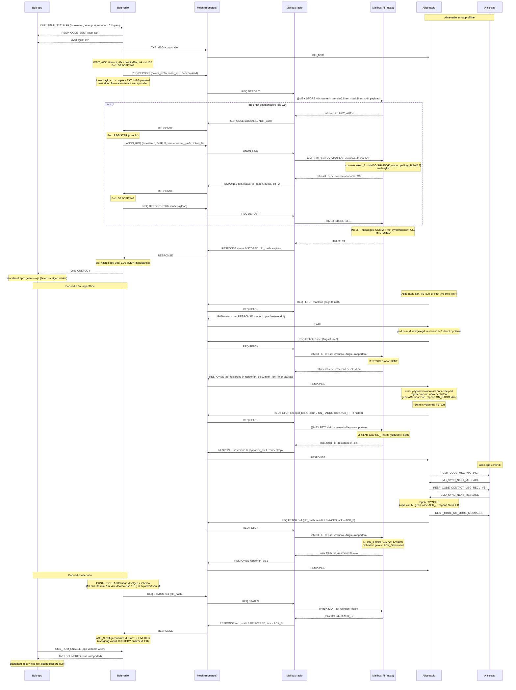

**Uitkomst**: bij Bob CUSTODY, na terugkeer DELIVERED; M kan "afgeleverd" niet vervalsen, want Bob controleert `ACK_S` zelf. Zendtijd 7,9 s per hop (`03`: DEPOSIT, FETCH met kopie, FETCH ON_RADIO, FETCH SYNCED, 2× STATUS, elk met antwoord). Hier één STATUS minder, maar extra de mislukte eerste DM (1,72 s), de flood-FETCH met PATH-return en eventueel de registratie.

**Gat in ontwerp**

- **G8** CUSTODY heeft geen overgang voor STATUS DELIVERED met geldige `ACK_S`, en ook niet voor een `RECEIPT_QUERY`-antwoord ON_RADIO of SYNCED op een probe; de toestandsmachine gaat alleen via ON_RADIO naar DELIVERED. Precies dit scenario (Bob weg tot na de sync) slaat ON_RADIO over. Ook onbepaald: krijgt de standaard app `PUSH_CODE_SEND_CONFIRMED` als Bob alleen `ACK_S` ziet en nooit `ACK_R` (STATUS draagt één ack)?
- **G9** Registratie: bij een cache-miss kan de mailboxradio Bobs REQ niet ontsleutelen en antwoordt niet; `03` par. 7 zegt dat Bob dan na een time-out opnieuw registreert, maar de toestandsmachine stuurt "geen antwoord" naar RETRY en gaat alleen bij NOT_AUTH naar REGISTER. Verder onbepaald: welke Pi-regel `@MBX REG` beantwoordt (`mbx.ok`, `mbx.acl` of beide) en welke waarden `status` in het registratieantwoord heeft.
- **G10** Bobs T_radio is 7 dagen, de TTL op de Pi per owner tot 30 dagen (`ttl_dagen`, `expires`). Niet vastgelegd of Bob in CUSTODY `expires` overneemt. Verloopt Bob eerder dan M, dan staat de entry op EXPIRED en is er geen receipt-watch, dus een latere aflevering via M ziet Bob nooit.
- G5 (unreported na herverbinden).

### 8. Alice haalt op, radio verliest berichten vóór telefoon-sync: RESYNC

Alice heeft de kopie opgehaald en ON_RADIO gerapporteerd; Bob heeft dat via STATUS gezien. Daarna verliest Alice' radio inbox en register (zoals in scenario 6) terwijl haar app nog niet synct. Haar eerstvolgende FETCH draagt de vlag RESYNC; M zet haar ON_RADIO-berichten terug op STORED en levert opnieuw af met een nieuwe tag.

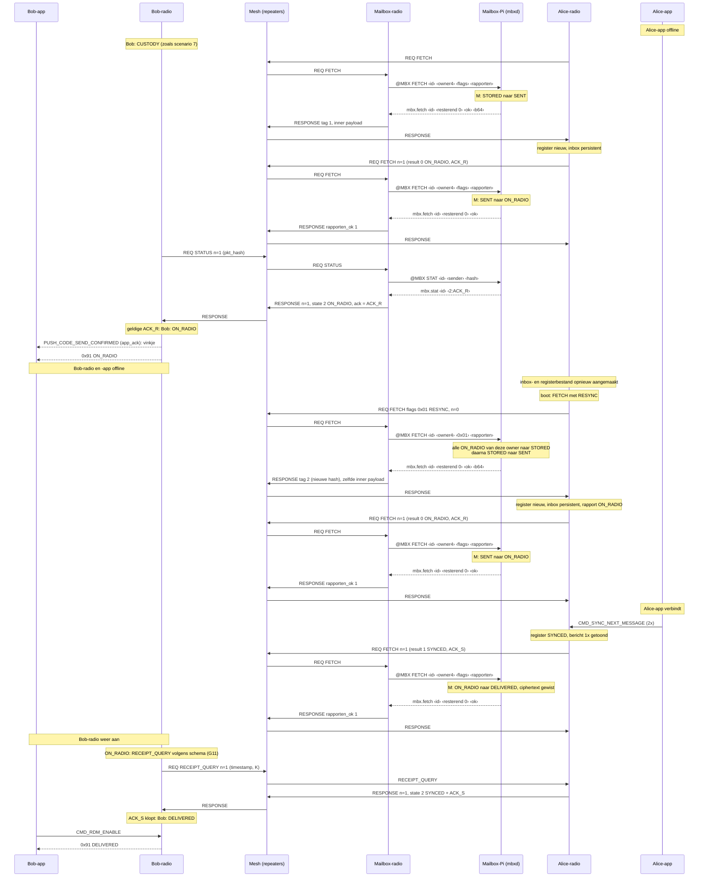

**Uitkomst**: DELIVERED, Alice ziet het bericht één keer; de ciphertext bleef bij M staan tot SYNCED, daardoor kan M opnieuw afleveren. Was Bob tijdens het verlies online geweest, dan had zijn `RECEIPT_QUERY` UNKNOWN gekregen en had hij ook zelf direct verstuurd; Alice' register vangt de tweede kopie dan als duplicaat (rapport DUPLICATE). Zendtijd: 7,9 s uit `03` plus ~3,1 s voor de heraflevering (FETCH met kopie 2,13 s, FETCH ON_RADIO 0,95 s; afgeleid).

**Gat in ontwerp**

- **G11** In ON_RADIO staat voor een bericht via M alleen `RECEIPT_QUERY` in het schema van `03` par. 5, geen STATUS naar M, terwijl de overgang "STATUS DELIVERED met geldige `ACK_S`" wel bestaat en de 7,9 s twee STATUS-rondes meetelt. Is Alice niet direct bereikbaar voor Bob (de reden voor de mailbox), dan ziet Bob "afgeleverd" niet via M.
- **G12** RESYNC: `03` zegt niet hoe Alice' radio vaststelt dat haar inbox opnieuw geformatteerd is, en of RESYNC ook geldt als alleen het register weg is. Verder gaan met het register ook openstaande rapporten verloren: een SYNCED-rapport dat M nog niet met `rapporten_ok` bevestigde, laat M op ON_RADIO, RESYNC zet het terug op STORED, en Alice' app krijgt een al gesynct bericht opnieuw (duplicaat, vergelijk G7).

### 9. Mailbox onbereikbaar of achterhaald terwijl Alice direct bereikbaar is

Review I4: de mailbox mag directe aflevering niet stilzetten. In 9a antwoordt de Pi niet op de DEPOSIT en valt Bob terug op probes naar Alice. In 9b bewaart M het bericht wel (CUSTODY), maar Alice haalt daar niet (meer) op, bijvoorbeeld omdat ze van mailbox wisselde of M achterhoudt; Bob probet Alice dan elke 24 u en levert direct af.

**9a. Mailbox onbereikbaar bij DEPOSIT**

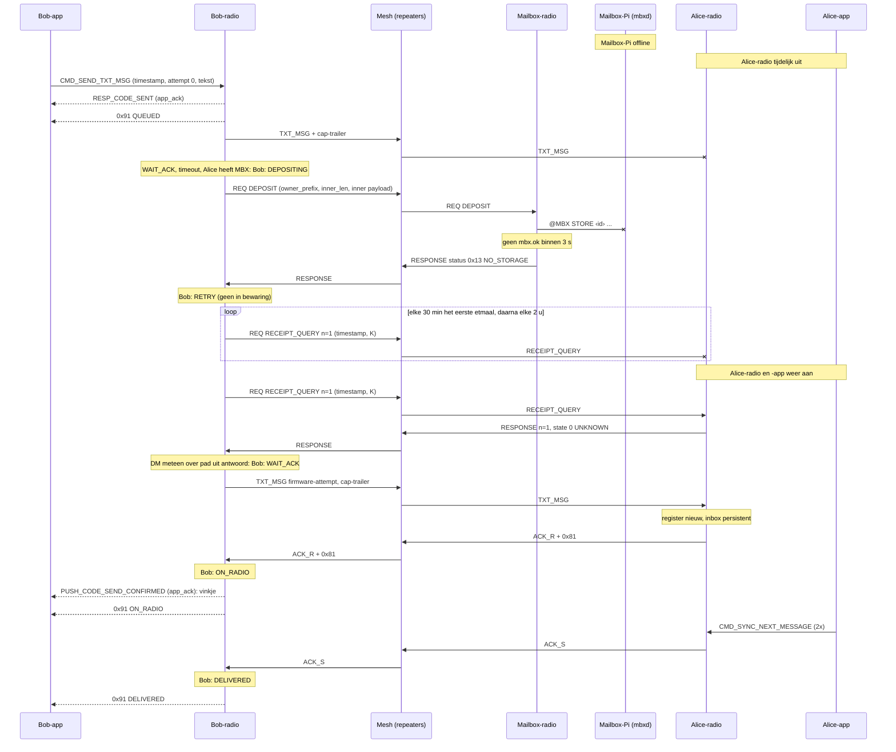

**9b. Mailbox achterhaald: M bewaart, Alice haalt daar niet op**

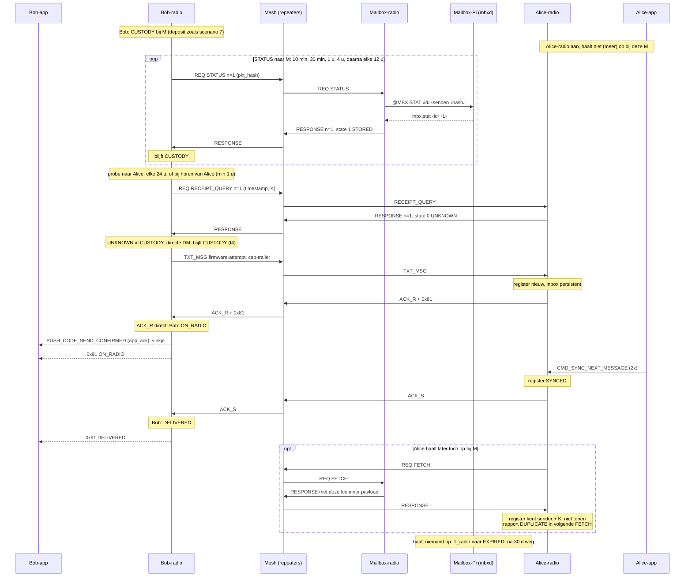

**Uitkomst**: in beide gevallen DELIVERED zonder duplicaat. In 9a ziet Bob nooit "in bewaring"; in 9b wel, maar de aflevering loopt direct. Kost van de terugval: in 9b duurt het tot de volgende 24-uursprobe (of het horen van Alice) voordat Bob direct aflevert. Kent M het bericht niet meer (STATUS UNKNOWN), dan gaat Bob terug naar RETRY. Zendtijd (afgeleid): 9a 1,72 + 2,26 (DEPOSIT met antwoord) + 0,82 + 1,72 + 0,56 = 7,1 s plus 0,41 s per onbeantwoorde probe; 9b 2,26 + 0,82 + 1,72 + 0,56 = 5,4 s plus 0,82 s per STATUS-ronde (zonder de mislukte eerste DM).

**Gat in ontwerp**

- **G13** Na een mislukte DEPOSIT (geen antwoord, QUOTA, NO_STORAGE) staat Bob in RETRY, en RETRY gaat alleen naar WAIT_ACK bij een probe-antwoord of het horen van Alice. Blijft Alice onbereikbaar, dan deponeert Bob niet opnieuw als M weer werkt: geen "in bewaring" en in de praktijk scenario 5.
- **G14** MBX_INFO en MBX_REVOKE: `03` zegt niet of Alice ze herhaalt als Bob niet ACKt, en niet wat Bob doet met entries in CUSTODY bij een mailbox die is ingetrokken of vervangen (opnieuw deponeren bij de nieuwe M, of alleen wachten op de 24-uursprobe).

### 10. Alice op standaard-firmware: graceful fallback

Alice draait standaard firmware. Ze toont de tekst tot de NUL, zet het bericht in haar RAM-queue en ACKt direct met de bestaande ACK zonder cap-byte. Bob ziet dan ON_RADIO_FINAL: "op Alice' radio" is het maximum. Er komt geen `ACK_S`, geen `RECEIPT_QUERY` en geen MBX_INFO.

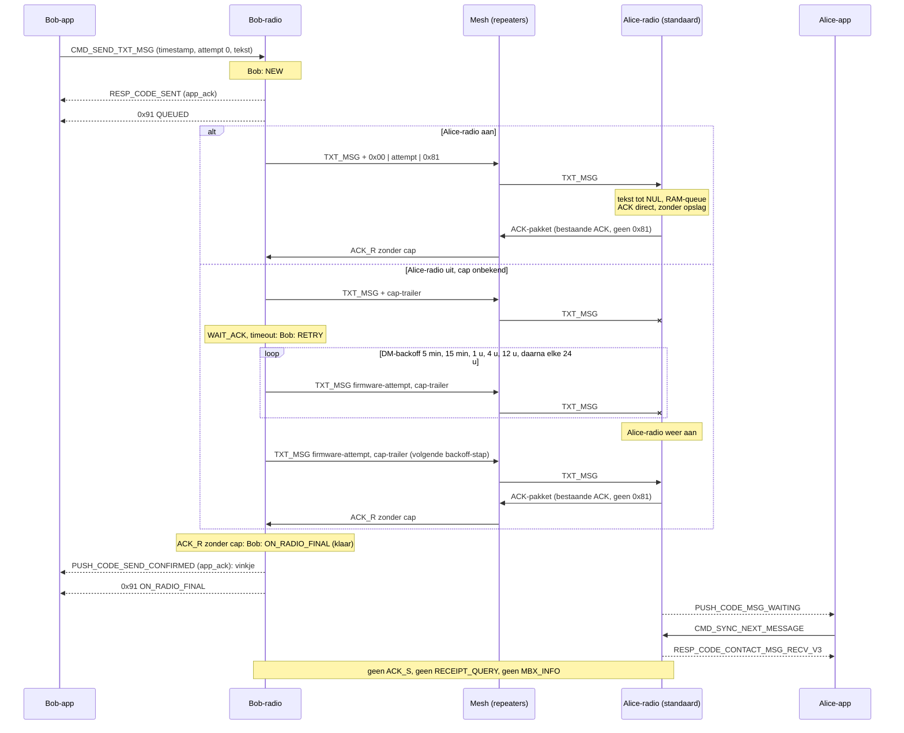

**Uitkomst**: ON_RADIO_FINAL, gelijk aan wat de standaard app nu "delivered" noemt; de outbox voegt alleen persistente retries toe. Wat Alice' standaard radio daarna doet valt buiten het ontwerp: RAM-queue vol (#3518) of een reboot verliest het bericht (L2, L3), en gaat een ACK verloren, dan toont Alice de volgende backoff-DM opnieuw (L6). Een mailbox is niet mogelijk, want alleen een fork-Alice stuurt MBX_INFO. Zendtijd 1,72 + 0,28 = 2,0 s per hop bij een directe ACK (afgeleid); met Alice uit 1,72 s per backoff-DM.

**Gat in ontwerp**

- **G15** Capability wordt nooit ingetrokken. Draaide Alice eerder de fork (cap bekend) en staat ze nu op standaard firmware, dan stuurt Bob in RETRY alleen `RECEIPT_QUERY`-probes; een standaard companion antwoordt niet op onbekende req_types, dus Bob stuurt geen DM meer en eindigt op EXPIRED terwijl Alice bereikbaar is (tenzij hij Alice toevallig hoort).

## Overzicht gaten in het ontwerp

| # | scenario | gat |
|---|---|---|
| G1 | 1, 6 | Afbeelding outbox-state naar 0x91-state niet vastgelegd, ook niet bij de terugval ON_RADIO naar RETRY. |
| G2 | 1, 5 | Wanneer een outbox-entry vrijkomt na een eindstatus. |
| G3 | 3 | Firmware-timeout van WAIT_ACK niet gekwantificeerd. |
| G4 | 3 | Probe-antwoord ON_RADIO of SYNCED in WAIT_ACK/RETRY (verloren `ACK_R`) heeft geen overgang. |
| G5 | 4, 7 | Aflevering van `unreported` statussen na herverbinden, voor 0x91 en voor `PUSH_CODE_SEND_CONFIRMED`. |
| G6 | 4 | Timers en schema's na een reboot zonder RTC; wel of geen query direct na boot. |
| G7 | 6 | Registerverlies na een sync met verloren `ACK_S`: UNKNOWN, herzending, duplicaat in Alice' app. |
| G8 | 7 | CUSTODY mist overgangen naar DELIVERED (STATUS DELIVERED) en naar ON_RADIO/DELIVERED op een probe-antwoord; vinkje als Bob nooit `ACK_R` ziet. |
| G9 | 7 | Registratie na cache-miss (par. 7 tegenover toestandsmachine), Pi-antwoord op `@MBX REG`, statuswaarden registratieantwoord. |
| G10 | 7 | T_radio van Bob tegenover `expires`/`ttl_dagen` van M; geen receipt-watch na EXPIRED. |
| G11 | 8 | Geen STATUS-schema in ON_RADIO voor berichten via M. |
| G12 | 8 | Detectie van RESYNC; verlies van openstaande SYNCED-rapporten geeft heraflevering en duplicaat. |
| G13 | 9a | Geen weg terug van RETRY naar DEPOSITING na een mislukte DEPOSIT. |
| G14 | 9b | Herhaling van MBX_INFO/MBX_REVOKE en gedrag van CUSTODY-entries bij een gewijzigde mailbox. |
| G15 | 10 | Capability wordt nooit ingetrokken; terugval naar standaard firmware geeft EXPIRED. |
