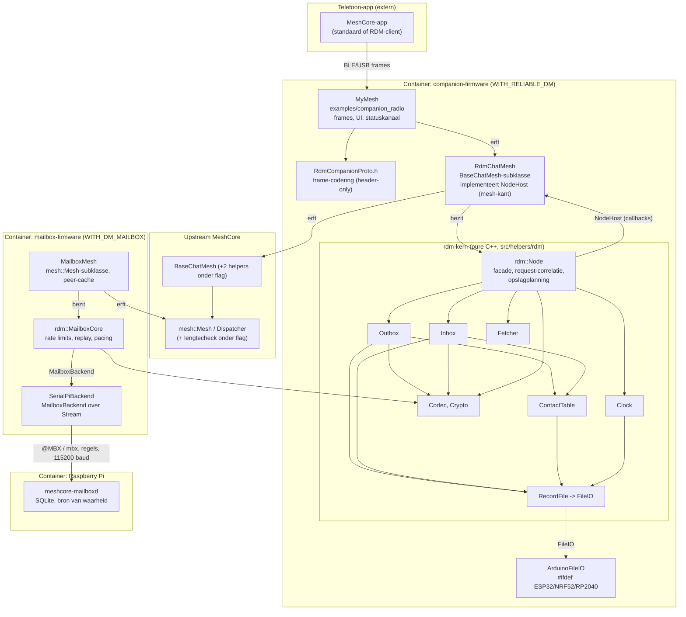

# 09: Architectuurreview v1

Scope: `git diff 22baa5e3..HEAD -- . ':!docs'` op `feature/reliable-dm` (124 bestanden, ~25k regels, waarvan ~4,4k in `src/helpers/rdm/*.cpp`). Referentie: `06` par. 2-3, `03`, `07`. Deze review kijkt naar structuur, niet naar correctheid; de kwaliteitsbevindingen van de parallelle /simplify-workers (reuse R*, altitude A*, simplification S*) worden hier alleen aangehaald waar ze architectuur raken.

## Samenvatting en eindoordeel

**Eindoordeel: goed, met drie structurele verbeterpunten vóór een upstream-PR.** De gelaagdheid uit `06` par. 2 is echt gerealiseerd: een pure C++-protocolkern zonder Arduino, radio of bestandssysteem, tijd als argument in de modules (functional core) en één imperatieve schil (`rdm::Node`) die tijd, toeval en I/O via hosts ophaalt. De upstream-footprint is klein, zit aan de randen en is aantoonbaar code-identiek zonder flag (`tools/rdm/check-upstream-identical.sh`). De mailbox heeft een heldere taakverdeling (radio: crypto, peers, rate limits, airtime; Pi: toestand en beleid) met gedeelde conformance-vectoren.

De drie punten die het zwaarst wegen:

1. **`NodeHost` is een dikke interface die via overerving in `RdmChatMesh` wordt gemengd.** Vier rollen in één contract (klok/RNG, contacten, transport plus crypto, app-pushes) en naamsbotsingen met `BaseChatMesh` (`sendAnonReq` moest met `using` worden hersteld). Dat is het eerste wat breekt bij een upstream-merge.
2. **Het companion-recept (verzenden, synchroniseren) bestaat twee keer**: in `MyMesh` en in `RdmSimCompanion`, en de meeste scenario's draaien op de kopie. De twee zijn al uiteengelopen.
3. **De grens radio <-> `meshcore-mailboxd` heeft geen versie en geen door de Pi geïnitieerde sessie-opbouw**: herstel na een daemon-herstart leunt op het neveneffect dat het openen van de seriële poort de ESP32 reset.

## Componenten zoals ze zijn (C4, componentniveau)

Afhankelijkheden lopen van boven naar beneden; de enige pijl omhoog is de callback-interface `NodeHost` (dependency inversion, bedoeld).

## 1. Lagen en afhankelijkheidsrichting

| bevinding | bewijs | oordeel |
|---|---|---|
| Kern is platformvrij: modules includen alleen elkaar, `<string.h>` en rweather `SHA256.h`; geen `Arduino.h`, `millis()`, FS of radio. `check-headers.py` en `test_rdm_headers` bewaken de header-hygiëne. | `src/helpers/rdm/RdmOutbox.cpp:1-6`, `RdmCrypto.cpp:3`, `tools/rdm/check-headers.py` | goed |
| Functional core / imperative shell: `Outbox`, `Inbox`, `Fetcher`, `Clock` krijgen `now` als argument; alleen `Node` haalt tijd bij de host. | `RdmOutbox.h:51-68`, `RdmNode.cpp:161-174` | goed |
| Richting klopt: `MyMesh -> RdmChatMesh -> BaseChatMesh -> Mesh`; `RdmChatMesh -> Node -> modules`. Geen `#include` van `.cpp`, geen globals in de kern, geen downcasts. | `RdmChatMesh.h:3-4,9`, `RdmNode.h:3-9` | goed |
| `src/helpers/rdm/` mengt drie lagen in één map: pure kern, mesh-integratie (`RdmChatMesh`, afhankelijk van `BaseChatMesh`) en platformadapter (`ArduinoFileIO`), plus de serverrol (`MailboxCore`). Omdat de envs `helpers/rdm/*.cpp` globben, schakelen `RdmNode.cpp` en `RdmChatMesh.cpp` zichzelf met een bestandsbrede `#ifdef` uit in de mailbox-build, terwijl `RdmOutbox.cpp` e.a. dat niet doen en dus dood meegecompileerd worden. De laag is zo alleen uit conventie af te lezen, niet uit de structuur. | `RdmNode.cpp:2`, `RdmChatMesh.cpp:1-2`, `variants/heltec_v3/platformio.ini:402`, A7 | verbeterpunt |
| Verborgen temporele koppeling: `MyMesh::onPeerDataRecv` leest een vlag `_rdm_new_msg` die `pushMsgWaiting()` zet tijdens de basisaanroep, en parset daarna de tekst opnieuw voor de UI-preview. | `examples/companion_radio/MyMesh.cpp:2650-2667,2704`, A10 | verbeterpunt |
| `RdmChatMesh` leunt op volgorde-state tussen `searchPeersByHash` en `getPeerSharedSecret`/`onPeerDataRecv` (`_n_base_match`, `_hidden_match`). Dat is hetzelfde idioom als upstream `matching_peer_indexes`, dus consistent, maar fragiel als upstream de dispatchvolgorde wijzigt. | `RdmChatMesh.cpp:41-65` | acceptabel |

## 2. Interfaces en contracten

| bevinding | bewijs | oordeel |
|---|---|---|
| `FileIO` (7 methoden), `MailboxBackend` (8), `MailboxCoreHost` (4), `OutboxHost` (12), `InboxHost` (3), `FetcherHost` (3) zijn smal en per client gesneden. `Node` implementeert de drie modulehosts privé en vertaalt ze naar `NodeHost`: een nette mediator. | `RdmStorage.h:8-18`, `RdmNode.h:44`, `MailboxCore.h:18-39` | goed |
| `NodeHost` heeft 17 methoden in vier rollen: tijd/toeval, contacten, transport inclusief `encrypt/decryptTxtPayload`, en app-pushes. De header zegt het zelf: `RdmChatMesh` implementeert de mesh-helft, `MyMesh` en de simulator de app-helft. Twee implementeerders van twee helften is precies het signaal voor interface segregation. | `RdmNode.h:15-42`, `RdmChatMesh.h:7-8,31-46` | probleem |
| `RdmChatMesh` erft `NodeHost` in plaats van hem te bezitten. Daardoor komen `millis()`, `random32()`, `txIdle()`, `sendAck()`, `sendReq()`, `sendAnonReq()` in de naamruimte van `BaseChatMesh`. `sendAnonReq` verborg al een upstream-overload (`using BaseChatMesh::sendAnonReq`), en `MyMesh` moet `static_cast<rdm::NodeHost&>(*this).sendTxtPlain(...)` schrijven. Elke nieuwe upstream-methode met zo'n naam wordt stil verborgen of overschreven. | `RdmChatMesh.h:9-11`, `MyMesh.cpp:2515` | probleem |
| `Node::onAppSend` volgt ask-in-plaats-van-tell: de caller krijgt `AppSend{handled, transmit, cap_trailer, attempt}`, bouwt zelf de plaintext, zendt en meldt terug met `onAppTransmitted`. Dat driestappenprotocol staat daardoor in elke caller (zie 7). `cap_trailer` is altijd gelijk aan `handled`. | `RdmNode.h:57-59`, `RdmNode.cpp:201-205`, `MyMesh.cpp:2505-2530` | verbeterpunt |
| `RecvDecision` als beslisobject (inbox beslist, `RdmChatMesh` voert de ACK's uit) is juist wel goed: pure beslissing, I/O in de schil. | `RdmInbox.h:45-51`, `RdmChatMesh.cpp:107-130` | goed |
| Ownership en levensduur: alles by reference in constructors, modules in-place via `Node::Late<T>` (placement new, geen heap), paden als statische literals. Duidelijk en MCU-geschikt; `Late<T>` is wel een zelfgebouwde `optional` die een review verdient. | `RdmNode.h:87-99`, `RdmNode.cpp:124-137` | goed |
| Foutafhandeling is overal `bool`: "false" betekent in `FileIO` I/O-fout, in `OutboxHost::contactPub` "contact weg", in `pushUserStatus` "geen 0x91-client". Consistent gedocumenteerd in commentaar, niet in het type. Voor een MCU-codebase in upstream-stijl acceptabel. | `RdmOutbox.h:31-43` | acceptabel |
| Cohesie: `Node` kent de recordgroottes en paden van alle modules en plant de slotaantallen uit vrije flash. Dat is opslagbeleid in de facade; de modules kennen hun eigen recordgrootte daarnaast ook nog (dubbel). | `RdmNode.cpp:15-63,103-137`, `RdmOutbox.cpp:20-21`, S5, S8 | verbeterpunt |
| `BackendReply` is een platte "variant" (~230 bytes) met velden per `Kind`. Pragmatisch zonder heap; de semantiek per soort staat alleen in commentaar. | `MailboxCore.h:7-16` | acceptabel |

## 3. Hardware-abstractie

| bevinding | bewijs | oordeel |
|---|---|---|
| Radio via upstream `mesh::Radio`, klok/RNG via `NodeHost`/`MailboxCoreHost`, flash via `FileIO`, Pi-link via `Stream&`. De kern draait native in 14 `test_rdm_*`-suites; alleen de integratielaag en de companion hebben de simulator-shims nodig. | `SerialPiBackend.h:12`, `platformio.ini` `[env:native_rdm]` | goed |
| Platformcode staat op één plek: `ArduinoFileIO` (ESP32/RP2040 `fs::FS`, nRF52/STM32 Adafruit LittleFS). Een nieuw platform of een andere backend raakt de kern niet (OCP gehaald). | `ArduinoFileIO.h:7-15` | goed |
| `ArduinoFileIO::freeBytes` negeert op ESP32 zijn geïnjecteerde `_fs` en vraagt de globale `SPIFFS`; op nRF52 gebruikt hij de interne `_getFS()` van Adafruit. Werkt vandaag omdat de ESP32-companion op SPIFFS draait, maar een ESP32-board met LittleFS of een secundaire FS krijgt een verkeerd budget en dus een verkeerde slotplanning. | `ArduinoFileIO.cpp:115-126`, `examples/companion_radio/main.cpp:120` | verbeterpunt |
| STM32 staat in de `#if` maar er is geen STM32-env; die tak is ongetest. | `ArduinoFileIO.h:10` | verbeterpunt (klein) |
| `MailboxCore` hardcodeert `CLIENTS = 64` "same size as the host's peer cache", terwijl `MBX_PEER_CACHE_SIZE` overschrijfbaar is. Wie de cache vergroot, krijgt stil een kleinere rate-limit-tabel. | `MailboxCore.h:56`, `MailboxMesh.h:7-8` | verbeterpunt |

## 4. Designprincipes

| bevinding | bewijs | oordeel |
|---|---|---|
| **SRP/Outbox**: 1308 regels, per slot 30 RAM-velden (timers, stappen, repeats, depositstatus) naast het persistente `OutEntry`. Verzenden, probes, mailbox-deposit, status, register en receipt-watch zitten in één klasse. De toestandsovergangen lopen wel centraal via `setState` (20 aanroepen) met bijwerkingen op één plek, maar `begin()` zet toestanden direct voor boot-herstel. Er is geen expliciete overgangstabel. | `RdmOutbox.h:82-104,143-169`, `RdmOutbox.cpp:170-200,343-360` | verbeterpunt |
| **DIP**: goed toegepast; hosts en `FileIO` zijn abstracties die de kern bezit, implementaties staan erbuiten. | par. 2 | goed |
| **OCP**: nieuwe backend of platform zonder kernwijziging, zie 3. Een nieuw REQ-type vergt wel wijzigingen in `Node::onResponse` (switch), `Pending`-union en codec. Voor een protocol met vaste wire-formaten redelijk. | `RdmNode.cpp:296-341` | acceptabel |
| **DRY**: kleine helpers en timingregels staan meervoudig (put32/get32 7x, jitter 3x, recordgroottes 2x). Architectuurrelevant is vooral dat protocolparameters aan twee kanten van een contract los staan: `RDM_MBX_REQ_GAP_S = 6` (client) tegen `REQ_GAP_MS = 5000` (server), alleen verbonden door commentaar; en `RETRY_AFTER_LOSS_S`, `T_MAX_CUSTODY_S` staan in `RdmOutbox.cpp` in plaats van `RdmConfig.h`. | `RdmConfig.h:38`, `MailboxCore.cpp:12-17`, `RdmOutbox.cpp:22-23`, R1, R8, S5 | verbeterpunt |
| **KISS/YAGNI**: `Node::nextWakeupMillis` claimt "sleep decisions on the device" maar wordt alleen door de simulator gebruikt; `Node::setEnabled` heeft geen productie-aanroeper. Beide zijn legitieme testnaden, maar documenteer ze als zodanig. `AppSend::cap_trailer` is overbodig. | `RdmNode.h:49-54`, `MyMesh.h:314` | verbeterpunt (klein) |
| **Configuratie**: slotmaxima overschrijfbaar per board (`#ifndef`), protocoltijden vast. Goed onderscheid; wel macro's in plaats van `constexpr`, wat botst met de `rdm::`-namespace-stijl van de rest. | `RdmConfig.h:5-53` | acceptabel |
| **Testbaarheid als ontwerpkracht**: zichtbaar in `nextDue`/`millisUntil` (fast-forward), `FileIO` met foutinjectie, `MailboxBackend` met vier implementaties. | `RdmClock.h:18-20`, `test/rdm_support/` | goed |

## 5. Feature-flag-architectuur

| bevinding | bewijs | oordeel |
|---|---|---|
| Upstream-kern: 1 hunk in `Mesh.cpp`, 2 in `BaseChatMesh.{h,cpp}`. Alle RDM-code in eigen bestanden. Bewezen code-identiek zonder flag voor 7 envs, inclusief repeater en room server. | `src/Mesh.cpp:490-495`, `BaseChatMesh.h:150-153`, `tools/rdm/check-upstream-identical.sh:16-22` | goed |
| `MyMesh`: 11 hunks van 1-6 regels aan de randen (`begin`, `loop`, `handleCmdFrame`, constructor) plus één blok van ~280 regels onderaan. `RDM_STATUS_CHANNEL` zit alleen binnen dat blok, met een `#error` als hij zonder `WITH_RELIABLE_DM` wordt gezet. Onderhoudbaar bij merges. | `MyMesh.cpp:807-809,903-910,1013-1016,1158-1163,2444-2453,2495-2769`, `MyMesh.h:90-104` | goed |
| `MyMesh::onContactPathRecv` krijgt `#ifdef ... return RdmChatMesh::...; #endif return BaseChatMesh::...;`: onbereikbare code met flag, en elke nieuwe `BaseChatMesh::`-aanroep in `MyMesh` moet opnieuw zo'n hunk krijgen. | `MyMesh.cpp:807-810` | verbeterpunt |
| De `Mesh::createDatagram`-lengtecheck verandert kerngedrag onder flag: met flag laat dezelfde functie grotere payloads toe. Upstream zal vragen waarom de exacte check niet voor iedereen geldt. | `src/Mesh.cpp:490-495` | verbeterpunt (vóór PR) |
| `BaseChatMesh` krijgt `rdm`-geprefixte helpers (`rdmMatchedPeer`, `rdmSendAckTo`) die generiek zijn: een protected accessor op `matching_peer_indexes` en `sendAckTo` protected maken. | `BaseChatMesh.cpp:60-70` | verbeterpunt (vóór PR) |

## 6. Mailbox als systeem

| bevinding | bewijs | oordeel |
|---|---|---|
| Taakverdeling is scherp: radio doet crypto, peer-cache, replay/rate limits, pacing en airtime; `meshcore-mailboxd` doet toestand, TTL, quotum, token, denylist, RESYNC en ziet nooit plaintext. RATE_LIMITED komt alleen van de radio. | `06` par. 3.15, `meshcore-mailboxd/README.md` | goed |
| `MailboxCore` is backend-agnostisch; vier backends bewijzen dat (`SerialPiBackend`, `MemMailboxBackend`, `SubprocessBackend`, plus `meshcore-mailboxd` via stdio). | `test/rdm_support/*Backend.h` | goed |
| Het regelprotocol is een goed gedefinieerde, tekstuele, tolerante grens (onbekende regels genegeerd, 3 s time-out naar NO_STORAGE, commit vóór antwoord). Maar: geen protocolversie (HELLO draagt alleen de firmwareversie, de daemon logt die), en de spec staat verdeeld over `06` par. 3.16, de README en de vectoren. | `mbxd.py:223-227` (v1-daemon, vervangen), `06` par. 3.16 | verbeterpunt |
| Sessie-opbouw is alleen radio-geïnitieerd. Een daemon-herstart komt alleen weer in sync omdat `ser.open()` de ESP32 reset; ACL-wijzigingen (nieuwe owner) vereisen daarom een herstart. Op een board waar poort-open niet reset (nRF52 USB-CDC, sommige USB-UART-bruggen) blijft de radio `ready` met een oude ACL. | `mbxd.py:467-470` (v1-daemon, vervangen), `SerialPiBackend.cpp:126,205,234`, README "restart mbxd" (v1) | probleem |
| Pi vervangen: een andere daemon moet het regelprotocol spreken en de semantiek van de conformance-vectoren volgen. De vectoren testen op operatieniveau (`store/reg/fetch/stat`), niet op regelniveau; de regelcodering wordt alleen via `SubprocessBackend` tegen de echte `meshcore-mailboxd` getest. Een vervanger heeft dus een eigen adapter nodig om de vectoren te draaien. | `test/rdm_vectors/mailbox_conformance.json`, `06` par. 3.17 | verbeterpunt |
| Semantiek bestaat twee keer (`meshcore-mailboxd`, `MemMailboxBackend.cpp` ~400 regels), bewust, bewaakt door dezelfde vectoren en een S07-variant tegen echte `meshcore-mailboxd`. | `06` par. 9 | acceptabel |

## 7. Testarchitectuur

| bevinding | bewijs | oordeel |
|---|---|---|
| Drie lagen: unit per module (native, `MemFileIO` met foutinjectie), node-niveau met nep-draad (`test_rdm_node/wire.*`), scenario's in de simulator met echte crypto en echte `MyMesh`. Plus conformance in C++ en Python. ~414 tests. | `test/test_rdm_*`, `07` par. 2 | goed |
| `RdmSimCompanion` is een tweede implementatie van de companion-app-kant naast de echte `MyMesh`, en 23 van de 27 scenario's draaien op die kopie; alleen S03, S04, S07 en S13 draaien (ook) op `CompanionModel::FIRMWARE`. De kopie is al gedivergeerd (`cap_trailer` hard `true`, geen fallback-`est_timeout`). Wat de scenario's bewijzen, geldt dus grotendeels voor de testkopie, niet voor de firmware. | `test/rdm_support/RdmSimCompanion.cpp:28-48`, `test/test_rdm_scenarios/test_rdm_scenarios.cpp:308,363,707,1070`, A1, R3 | probleem |
| Testhulpcode dupliceert productiecode: `SubprocessBackend` herimplementeert het regelprotocol van `SerialPiBackend`; `MemFileIO` en `SimFileIO` zijn dezelfde map-FS; SFINAE-steigers in `CompanionNode` uit de WP6-overgang. | A2, A4, A5, R2, R10 | verbeterpunt |
| Testhaken in productiecode zijn beperkt: `using RdmChatMesh::rdm` maakt heel `Node` publiek op `MyMesh` "voor simulator en tests"; `Node::setEnabled` alleen door tests gebruikt; `meshcore-mailboxd --fake-clock` alleen met `--stdio`. Geen `friend`, geen `#ifdef UNIT_TEST`. | `MyMesh.h:314`, `meshcore-mailboxd/src/cli.rs` | acceptabel |

## 8. Evolueerbaarheid richting upstream-PR

Wat een upstream-maintainer als eerste op architectuurgronden zal afwijzen, in volgorde van waarschijnlijkheid:

1. **Omvang en vorm van één PR**: ~25k regels, waarvan een companion-protocoluitbreiding, een nieuwe firmwarerol en een Python-daemon. Verwacht: opsplitsen in (a) generieke upstream-API's en de #3518-fix, (b) de kern plus `RdmChatMesh`, (c) companion, (d) mailbox.
2. **Naamruimtevervuiling van `BaseChatMesh`** door de `NodeHost`-overerving (par. 2). Een maintainer die later `BaseChatMesh::sendAck` of `millis` toevoegt, breekt de fork stil.
3. **Flag-afhankelijk kerngedrag in `Mesh::createDatagram`** en `rdm`-geprefixte helpers in `BaseChatMesh` (par. 5).
4. **Commentaar verwijst naar fork-interne documenten**: 106 verwijzingen als `03 par. 11`, `G16`, `K3`, `WP6` in code die upstream zou krijgen, zonder die documenten. Upstream-commentaar moet zelfstandig leesbaar zijn.
5. **Companion-protocolcodes** (`0xC0-0xC2`, `0x40-0x42`, `0x91`) zijn eenzijdig gekozen; zonder afstemming botsen ze met toekomstige upstream-codes.
6. **`Outbox` als één klasse van 1300 regels** met 30 RAM-velden per slot is lastig te reviewen voor iemand zonder de ontwerpdocs.

Wat juist in het voordeel spreekt: de bewezen code-identiteit zonder flag, de volledig native testbare kern, en het feit dat `RdmChatMesh` alleen bestaande virtuele hooks gebruikt.

## Aanbevelingen (geprioriteerd)

| # | wanneer | probleem | voorstel | impact | risico | grootte |
|---|---|---|---|---|---|---|
| 1 | nu | Companion-recept dubbel (`MyMesh`, `RdmSimCompanion`), al gedivergeerd; scenario's testen grotendeels de kopie (par. 7). | Verplaats het send- en sync-recept naar `RdmChatMesh` (bijv. `rdmSendApp(contact, ts, attempt, text) -> {handled, app_ack, flood, est_timeout}` en `rdmNextInbox(InRecord&)`), zodat `MyMesh` en de simulator dezelfde code aanroepen. Draai daarna de scenario's standaard op `CompanionModel::FIRMWARE` en houd `SIM` alleen waar de frame-laag in de weg zit. | Scenario's bewijzen de firmware; één plek voor I8-logica; `AppSend` vereenvoudigt (tell-don't-ask). | Laag: gedrag gelijk, tests vangen afwijkingen. Header `RdmChatMesh.h` wijzigt (via tech lead). | M |
| 2 | nu | Sessie-opbouw radio <-> `meshcore-mailboxd` leunt op poort-reset; ACL-wijziging vereist herstart (par. 6). | Laat de daemon bij start (en na `owner-add`/`deny` via een admin-signaal) ongevraagd `mbx.hello?` of direct de ACL plus `mbx.ready` sturen, en laat `SerialPiBackend` een nieuwe ACL-reeks altijd accepteren. Voeg een protocolversie toe aan `@MBX HELLO` en `mbx.ready`. | Robuust tegen Pi-herstart, board-onafhankelijk, geen herstart meer na `owner-add`. | Middel: raakt het vastgelegde regelprotocol (`06` par. 3.16) en beide kanten; conformance en S07 tegen de daemon dekken het. | M |
| 3 | vóór upstream-PR | `NodeHost` dik en via overerving in `BaseChatMesh`-naamruimte (par. 2). | Splits in `NodeMeshHost` (tijd, RNG, contacten, zenden, crypto) en `NodeAppSink` (pushes, `rtcNow`). Laat `RdmChatMesh` een privé geneste adapter bezitten in plaats van `NodeHost` te erven; `MyMesh` geeft zijn app-sink mee. Verwijdert `using BaseChatMesh::sendAnonReq` en de `static_cast` in `MyMesh`. | Geen naamsbotsingen bij upstream-merges; ISP; duidelijker wie wat implementeert. | Middel: vastgelegde header `RdmNode.h` en `RdmChatMesh.h` wijzigen; puur mechanisch, tests dekken het. | M |
| 4 | vóór upstream-PR | Upstream-ingrepen zijn fork-specifiek geformuleerd (par. 5). | Stel `rdmMatchedPeer`/`rdmSendAckTo` voor als generieke, ongeflagde protected API (`getMatchedPeer(idx)`, `sendAckTo` protected). Stel de exacte lengtecheck in `createDatagram` voor als losse upstream-fix zonder flag. Vervang in `MyMesh` de dubbele `return`-hunks door een `typedef ... MyMeshBase` onder flag. | Kleinere, beter verdedigbare upstream-diff; minder hunks per merge. | Laag voor de fork; de ongeflagde variant raakt stock builds en valt buiten de huidige "code-identiek"-eis, dus alleen als aparte upstream-PR. | S |
| 5 | vóór upstream-PR | Commentaar verwijst 106x naar interne docs (par. 8). | Vervang `03 par. x`/`Gnn`/`Kn`/`WPn` door een korte zelfstandige reden (het "waarom"); houd één verwijzing naar een upstream te leveren ontwerp-README in `src/helpers/rdm/`. | Code leesbaar zonder de fork-docs. | Laag. | S |
| 6 | vóór upstream-PR | `src/helpers/rdm/` mengt kern, integratie, platformadapter en serverrol; buildselectie via glob plus bestandsbrede `#ifdef` (par. 1). | Noem bestanden per rol in de `build_src_filter` (of submappen `rdm/`, `rdm/arduino/`, `rdm/mailbox/`) en verwijder de bestandsbrede guards in `RdmNode.cpp`/`RdmChatMesh.cpp`. | Laag af te lezen uit de structuur; geen dode code in de mailbox-build. | Laag: alleen `platformio.ini` en includes. | S |
| 7 | nu | `ArduinoFileIO::freeBytes` gebruikt op ESP32 de globale `SPIFFS` en op nRF52 een interne Adafruit-API (par. 3). | Meet via de geïnjecteerde FS (ESP32 `fs::FS` heeft geen `totalBytes`, dus geef de adapter een `total/used`-functor of de concrete `SPIFFSFS&`/`LittleFSFS&` mee), en kapsel de nRF52-traversal in één functie met een versie-check van de lib. | Juiste slotplanning op elk FS; minder breuk bij lib-updates. | Laag. | S |
| 8 | nu | Contractparameters aan twee kanten los (`REQ_GAP` 6 s tegen 5 s, `CLIENTS` 64 tegen `MBX_PEER_CACHE_SIZE`, lokale constanten in `RdmOutbox.cpp`) (par. 3, 4). | Eén `RdmConfig.h`-bron: `RDM_MBX_SERVER_REQ_GAP_S` met `static_assert(RDM_MBX_REQ_GAP_S > ...)`, `MailboxCore` krijgt de clienttabelgrootte als template- of macroparameter gelijk aan de peer-cache, `RETRY_AFTER_LOSS_S`/`T_MAX_CUSTODY_S` naar `RdmConfig.h`. | Configuratie die niet stil uit elkaar loopt. | Laag. | S |
| 9 | later | `Outbox` is een god class (1300 regels, 30 RAM-velden per slot) zonder expliciete overgangstabel (par. 4). | Splits het RAM-schema per actie (DM/probe, deposit, status, watch) in kleine structs met eigen `due()`/`run()`, en leg de toegestane overgangen vast in één tabel die `setState` assert. Boot-herstel via `setState` met een "restore"-modus. | Reviewbaarheid, lokale redenering per mechanisme. | Middel: kernlogica; alleen met de volledige unit- en scenariosuite als vangnet. | L |
| 10 | later | Opslagbeleid in `Node` (paden, recordgroottes, slotplanning) naast dezelfde kennis in de modules; testdubbels dupliceren productie (`SubprocessBackend`, `MemFileIO`/`SimFileIO`) (par. 2, 7). | Laat elke module zijn `RECORD_SIZE`/pad exporteren en verplaats de planning naar een `StoragePlan`-helper. Laat `SubprocessBackend` `SerialPiBackend` over een pipe-`Stream` gebruiken; voeg `MemFileIO` en `SimFileIO` samen. | Eén bron per formaat; de regelcodering van de echte backend wordt meegetest. | Laag. | M |
